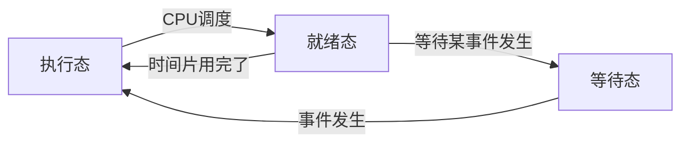

# 进程

## 理论

### 进程的定义

**定义:**

进程是一个运行着的程序，它包含了程序在运行时的各个资源，进程是操作系统进行调度的基本单位，也是
一个程序运行的基本单位。进程是一个程序一次执行的过程，是操作系统动态执行的基本单元。

**概念:**

1. 进程是一个实体,每个进程都有自己的虚拟地址空间
  
    * **代码区:** 文本区域存储处理器执行的代码
    * **数据区:** 存储变量和动态分配的内存
    * **堆栈区:** 存储活动进程动态申请的内存和局部变量及函数调用时的返回值

2. 进程是一个“执行中的程序”，它和程序有本质区别

    * 程序是静态的，它是一些保存在磁盘上的指令的有序集合（文件）
    * 进程是一个动态的概念，它是一个运行着的程序，包含了进程的动态创建、调度和消亡的过程，是 Linux 的基本调度单位

### 进程状态

进程是程序的执行过程，根据它的生命周期可以划分成 3 种状态。

* 执行态：该进程正在运行，即进程正在占用 CPU， 任何时候都只有一个进程。
* 就绪态：进程已经具备执行的一切条件，正在等待分配 CPU 的处理时间片。
* 等待态：进程正在等待某些事件，当前不能分配时间片，进程不能使用 CPU，若等待事件发生（等待的资源分配到）则可将其唤醒，变成就绪态。



==**注意:**== 等待态不能直接转换成执行态

### 进程描述

操作系统会为每个进程分配一个唯一的整型 ID,做为进程的标识号(pid)。

???+ note 

    进程标识是无法在用户层修改的（用户程序不能自己来修改自己的 pid,这是操作系统分配的）。
    
    进程除了自身的 ID 外,还有父进程ID(ppid)、0进程、init进程(1进程)、孤儿进程、僵尸进程,这些特殊进程。
    
    所有进程的祖先进程是同一个进程,它叫做 init 进程,ID 为 1，init 进程是内核启动后的运行的第一个进程。
    init 进程负责引导系统、启动守护（后台）进程并且运行必要的程序。它不是系统进程，但它以系统的超级用户特权运行

[特殊进程 :fontawesome-solid-paper-plane:](#teshu){ .md-button }


**ps 命令:** 类似任务管理器， ps 为我们提供了进程的一次性的查看，它所提供的查看结果并不动态连续的

**kill 命令:** 通常与 ps 命令一起使用，常用的形式： kill -9 进程 ID（表示向指定的进程 ID 发送 SIGKILL 的
信号。其中-9 表示强制终止，可以省略。它是信号代码，可以利用 kill –l 列出所有的信号。） 另外， pkill 进程名字(可以直接杀死指定进程名的进程)

**top 命令:** 和 ps 相比， top 是动态监视系统任务的工具， top 输出的结果是连续的，比如#top

**jobs 命令:** 观察后台进程。


### 进程的资源分配

* **代码区:** 加载的是可执行文件代码段， 可执行代码，在有操作系统支持时，程序员不需要关注这一位置。
代码区通常是只读的，只读的原因是防止程序意外地修改了它的指令。

* **数据段:** 
    * 已初始化数据区: 该区包含在程序中明确被初始化的全局变量，已经初始化的静态变量和常量数据。存储于该区的数据的生存周期为整个程序运行过程。
    * 未初始化数据区（ BSS 段）， 存入的是全局未初始化变量和未初始化静态变量还有初始值为 0 的变量。
    BSS 段的数据在程序开始之前的值都为 0，在程序退出时才释放。

* **栈区:** 由编译器自动分配释放，存放函数的参数值、返回值、局部变量等。在程序运行过程中实时加载和
释放，因此，局部变量的生存周期为申请到释放该段栈空间的过程。

* **堆区:** 用于动态内存分配。 堆区一般由程序员分配和释放，我们使用 malloc 申请的内存都属于堆区内存。

### 进程的特点

**动态性:** 进程的实质是程序的一次执行过程，进程是动态产生，动态消亡的

**并发性:** 任何进程都可以同其他进程一起并发执行

**独立性:** 进程是一个能独立运行的基本单位，同时也是系统分配资源和调度的独立单位;

**异步性:** 由于进程间的相互制约，使进程具有执行的间断性，即进程按各自独立的、不可预知的速度向前推进

### 进程的关系

父子关系 -- 该进程由谁产生，谁就是该进程的父进程，代码中往往是父进程管理子进程（父进程知道子进程的PID号）

### 特殊进程 {#teshu}

1. **父子进程:** 父进程帮助子进程收尸，回收资源，控制子进程，杀死子进程，暂停子进程，恢复子进程运行
2. **0号进程:** 系统启动的引导进程
3. **1号进程/祖先进程:** 操作系统启动起来的第一个程序
4. **孤儿进程:** 父进程结束，子进程还在运行 孤儿进程会被：/sbin/upstart --user 回收接管
5. **僵尸进程:** 子进程已经消亡，但是父进程为其收尸，没有做清理工作,放弃几乎所有资源，但是唯独占用pid号

## 实践

### 前知

* 获取当前进程的PID函数: `getpid` 
* 获取当前进程的父进程的PID函数: `getppid`
* 创建进程的函数: `fork` `vfork`
* 结束进程的方法:
    1. 信号:
        * 使用 ++ctrl+c++ 结束进程
        * 使用 kill -9 pid
    2. 在程序中用函数结束
        * 主函数 -- `return 0`
        * `exit(0)` -- 结束进程
        * `_exit(0)` --结束进程
* 进程等待函数:
    * `wait` -- 阻塞等待任意子进程结束，为其收尸
    * `waitpid` --  等待指定子进程结束，为其收尸

!!! example "函数原型"

    === "getpid"
        
        ```c

        功能:获得进程id
        函数原型:pid _t getpid(void)
        所属头文件:
        #include <sys/types.h>
        #include <unistd.h>
        参数:无
        返回值:调用该函数的进程id

        ```
    === "getppid"

        ```c

        功能:获得进程id
        函数原型:pid_t getppid(void)
        所属头文件
        #include <sys/types.h>
        #include <unistd.h>
        参数:无
        返回:值调用该函数的进程的父进程id

        ```
    === "fork"

        ```c

        功能:创建新进程
        原型:pid_t fork(void)
        所属头文件
        #include <unistd.h>
        #include <sys/types.h>
        参数:无
        返回值:在父进程中返回子进程的PID，在子进程中返回0，失败返回-1
               0:子进程
               子进程PID(大于0的整数):父进程
               -1:出错

        特点:fork成功后，会创建一个子进程，子进程会复制父进程资源父子进程同时从fork函数
        以下开始并行运行。互不干扰。拥有独立的数据段、堆栈，但无法确定父子进程的运行顺序

        ```
    === "vfork"

        ```c

        功能:创建子进程，并且阻塞父进程
        原型:pid_t vfork(void)
        所属头文件
        #include <unistd.h>
        #include <sys/type.h>
        参数:无
        返回值:在父进程中返回子进程的PID，在子进程中返回0，失败返回-1
        特点:vfork成功后，会创建一个子进程，子进程共用(独占)父进程资源，
            子进程退出父进程才会得到执行。分享父进程的数据段、堆，一定是子进程先运行

        ```
    === "exit(0)"

        ```c

        函数原型:void exit(int status);
        所属头文件:
        #include <stdlib.h>
        形参:一般直接写0
        返回值:无
        结束的时候，会清理缓冲区

        ```
    === "_exit(0)"

        ```c
        
        函数原型:void _exit(int status)；
        所属头文件:
        #include <unistd.h>
        形参:一般直接写0
        返回值:无
        结束的时候，不会清理缓冲区

        ```
    === "wait"

        ```c

        头文件:#include <sys/types.h>
        #include <sys/wait.h>
        函数原型:pid_t wait(int *status);
        形参:NULL
        返回值:成功返回结束的子进程的pid号
        失败返回-1

        ```
    === "waitpid"

        ```c

        函数原型:pid_t waitpid(pid_t pid, int *status, int options);
        形参:
        pid:指定等待哪一个子进程	
        -1:等待任意子进程结束
        status:NULL
        options:
        0:同wait，阻塞等待子进程结束，返回值同wait
        WNOHANG:若由 pid 指定的子进程不立即可用，则 waitpid 不阻塞，此时返回值为 0
        返回值:
        options如果是0，即阻塞等待，成功返回子进程的pid，失败返回-1；
        options如果是WNOHANG，即不则测等待，
        成功返回子进程pid，没等到返回0，失败返回-1；
        
        wait(NULL) 等价的 waitpid(-1,NULL,0)；

        ```

### 创建进程

**方式一:** 通过运行一个可执行程序，就可以运行一个进程


**方式二:** 通过函数 `fork()` 或者 `vfork()`

```c title="初识fork"

#include <stdio.h>
#include <unistd.h>
#include <sys/types.h>
int main()
{
  pid_t pid = fork();
  if(pid == 0)
  {
    printf("i am son\n");
  }
  else if(pid > 0)
  {
    printf("i am father\n");
  }

}

```


 

=== "使用3个fork"

    ```c

    #include <stdio.h>
    #include <sys/types.h>
    #include <unistd.h>
    int main()
    {
        fork();
        fork();
        fork();
        printf("nihao\n");
    }

    ```
=== "展开3个fork"

    ```c title="进程"
    
    #include <stdio.h>
    #include <sys/types.h>
    #include <unistd.h>
    
    int main()
    {
      pid_t pid1 = fork();//创建一个子进程并复制父进程
      
      if(pid1 == 0)
      {
        pid_t pid2 = fork();//创建一个子进程并复制父进程
        
        if(pid2 == 0)
          {
            pid_t pid3 =fork();//创建一个子进程并复制父进程
            if(pid3 == 0 )
              {
                printf("nihao\n");
              }
            else if(pid3 > 0)
              {
                printf("nihao\n");
              }
          }
        else if(pid2 > 0)
          {
            pid_t pid4 =fork();//创建一个子进程并复制父进程
            if(pid4 == 0 )
              {
                printf("nihao\n");
              }
            else if(pid4 > 0)
              {
                printf("nihao\n");
              }
          }
      }
      else if(pid1 > 0)
      {
        
        pid_t pid5 = fork();//创建一个子进程并复制父进程
        
        if(pid5 == 0)
          {
            pid_t pid6 =fork();//创建一个子进程并复制父进程
            if(pid6 == 0 )
              {
                printf("nihao\n");
              }
            else if(pid6 > 0)
              {
                printf("nihao\n");
              }
          }
        else if(pid5 > 0)
          {
            pid_t pid7 =fork();//创建一个子进程并复制父进程
            if(pid7 == 0 )
              {
                printf("nihao\n");
              }
            else if(pid7 > 0)
              {
                printf("nihao\n");
              }
          }
    
      }
      return 0;
    }
    
    ```
